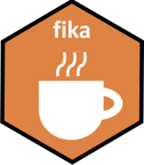

<!-- README.md is generated from README.Rmd. Please edit that file -->

# fika 

<!-- badges: start -->

[](https://www.tidyverse.org/lifecycle/#experimental)
[](https://travis-ci.org/mleary/fika)
<!-- badges: end -->

The *fika* package is designed to easily connect people from within a
group and (potentially) suggest a topic to kick off the conversation.
It’s goal is to help connect people.

# What is a Fika?

A fika is Swedish tradition that is similiar to a coffee break. But a
Fika is much much more than having a coffee. It is a social phenomenon,
a legitimate reason to set aside a moment for quality time. But don’t
take if from me, learn more from the [official Swedish
website](https://sweden.se/culture-traditions/fika/).

This approach probably doesn’t meet the traditional definition of a
fika, but hey the goal is to help people interact.

## Installation

You can install fika from Github with the `devtools` package.

``` r
library(devtools)

devtools::install_github("mleary/fika")
```

## Example

``` r
library(fika)

fika::topics[1:3] 
#> [1] "What was your favorite vacation?"         
#> [2] "What is your favorite cereal?"            
#> [3] "Favorite new TV show others should watch?"

fika::topic_add(fika::topics[1:3], "Favorite restaurant in your town and why?")
#> [1] "What was your favorite vacation?"         
#> [2] "What is your favorite cereal?"            
#> [3] "Favorite new TV show others should watch?"
#> [4] "Favorite restaurant in your town and why?"

dat <- data.frame(
  name = c("Steve", "Kathy", "Tim", "Terry", "Erin", "Emily", "Gail", "Robin", "Denny", "Marge"))

fika::create_groups(dat, min_group_size = 3)
#>     name Group
#> 1  Steve     2
#> 2  Kathy     1
#> 3    Tim     2
#> 4  Terry     2
#> 5   Erin     1
#> 6  Emily     3
#> 7   Gail     3
#> 8  Robin     3
#> 9  Denny     1
#> 10 Marge     1
```
